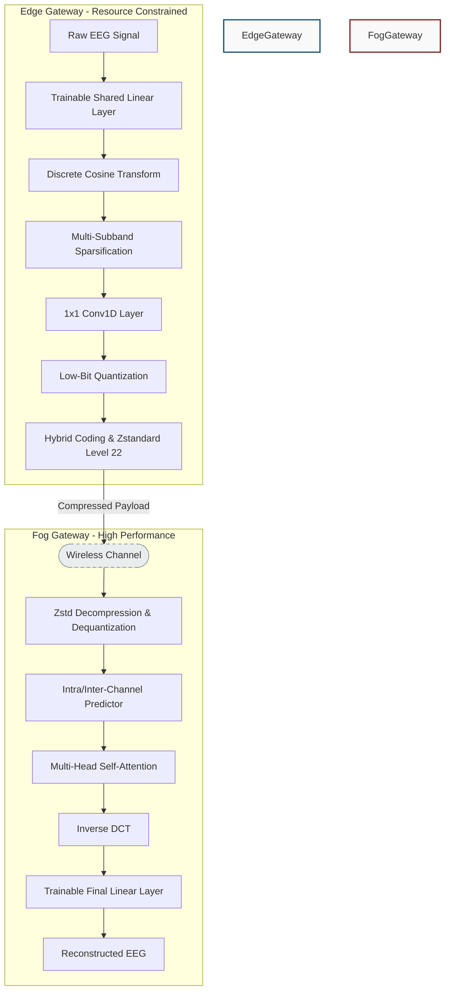

# Edge-Fog Computing-Enabled EEG Data Compression via Asymmetrical Variational Discrete Cosine Transform Network (AVDCT-Net)

A resource-efficient PyTorch-based framework designed for compressed sensing and low-latency transmission of multi-channel Electroencephalogram (EEG) signals in resource-constrained IoT, medical, and BCI Edge-Fog environments.

---

## 🌟 Project Overview
AVDCT-Net shifts the heavy computational reconstructive load to the Fog gateway while keeping the compression step at the Edge gateway extremely lightweight. By combining trainable linear projections, spectral domain sparsification (via Discrete Cosine Transform), learnable thresholding, and low-bit hybrid quantization, the framework achieves exceptional compression ratios while preserving superb signal reconstruction fidelity suitable for downstream clinical or BCI analysis.

---

## 🛠️ Key Architectural Components



---

## 🛠️ Installation & Setup

1. **Clone the Repository:**
   ```bash
   git clone https://github.com/VaishnaviThirumala07/Edge-Fog-Computing-Enabled-EEG-Data-Compression.git
   cd Edge-Fog-Computing-Enabled-EEG-Data-Compression
   ```
2. **Install Dependencies:**
   ```bash
   pip install -r requirements.txt
   ```

---

## 🏃 How to Run & Reproduce

All pipeline executions, evaluations, and visualizations are self-contained within each Jupyter notebook, eliminating the need to manage external Python scripts:

*   **Bonn EEG Evaluation:** Run all cells in `BonnDataset.ipynb` to evaluate the 5 physiological subsets, generate the compression statistics, and plot performance.
*   **BCI Competition II:** Run all cells in `BCI2Dataset.ipynb` to run training loops, apply low-bit hybrid quantization, and output signal similarity charts.
*   **BCI Competition III:** Run all cells in `BCI3Dataset.ipynb` to execute cross-subject validation and analyze cognitive task motor imagery arrays under domain transfer.
